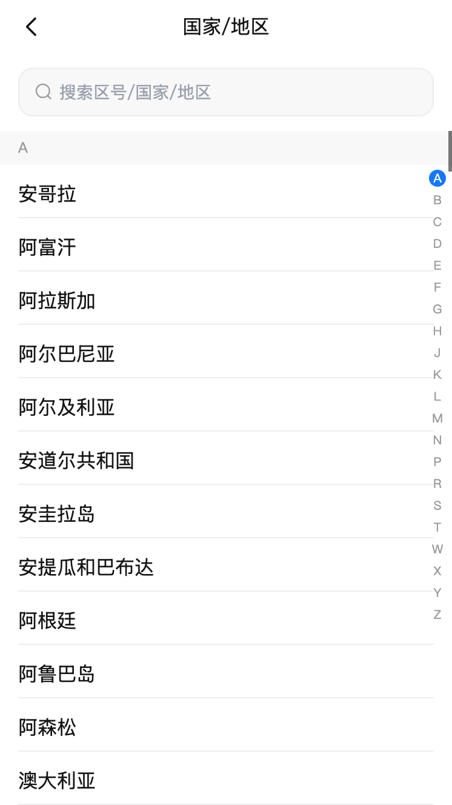
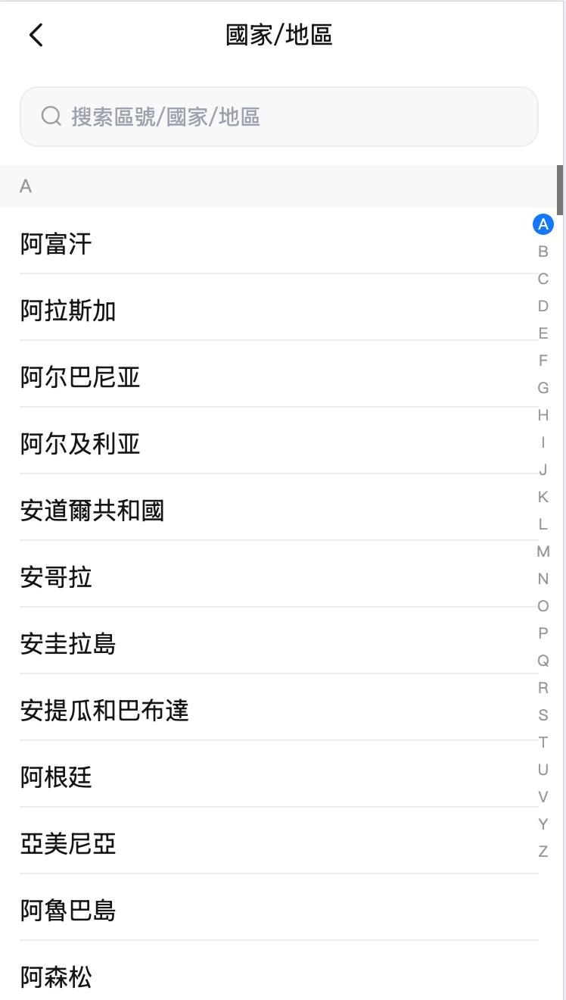
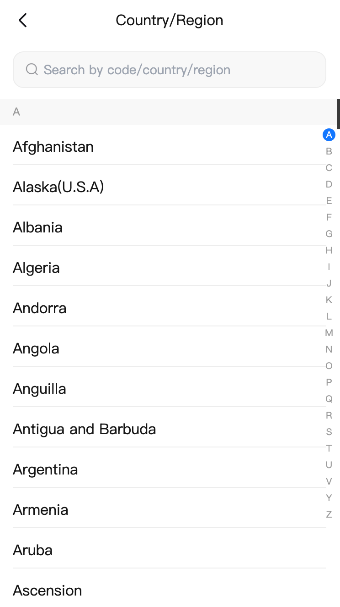

# react-select-country

## English

### Preview
When the language is zh-CN, it is sorted by pinyin, otherwise it is sorted by English.

<div style="display: flex; justify-content: space-between;">
  
  
  
</div>

### Installation
```
npm install react-select-country-mw --save
```

### Simple Import
```
import ReactSelectCountry from 'react-select-country-mw'
```

### Parameters
| Name | Type | Default | Description | Required |
|------|------|---------|-------------|----------|
| onSelect | (item: string) => void | - | Callback when an item is selected | No |
| onClose | () => void | - | Callback when closed | No |
| language | zh-CN,zh-HK,en | - | Language setting, default is en | No |
| height | number | - | Component height | No |
| letterListHide | boolean | false | Whether to hide the letter list | No |
| arrowHide | boolean | false | Whether to hide the arrow | No |
| className | string | - | ClassName for the outermost element | No |

---

## 中文

### 预览
当是zh-CN时是以拼音排序，其余情况以英文排序

<div style="display: flex; justify-content: space-between;">
  
  
  
</div>

### 安装
```
npm install react-select-country-mw --save
```

### 简单的导入
```
import ReactSelectCountry from 'react-select-country-mw'
```

### 可传的参数
| 参数名字 | 值类型 | 默认值 | 说明 | 是否必需 |
|---------|---------|--------|------|----------|
| onSelect | (item: string) => void | - | 选择项目时的回调函数 | 否 |
| onClose | () => void | - | 关闭时的回调函数 | 否 |
| language | zh-CN,zh-HK,en | - | 语言设置，默认en | 否 |
| height | number | - | 组件高度 | 否 |
| letterListHide | boolean | false | 是否隐藏字母列表 | 否 |
| arrowHide | boolean | false | 是否隐藏箭头 | 否 |
| className | string | - | 最外层元素的className | 否 |
